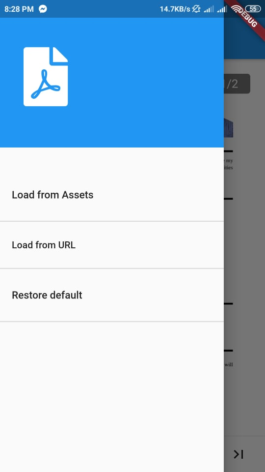
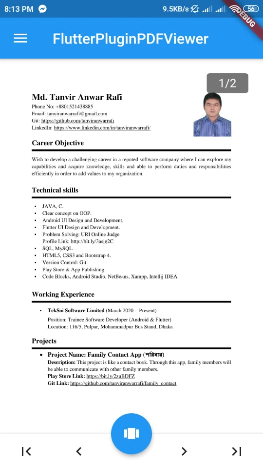

# Flutter Plugin PDF View

This project is for learning how to use pdfviewe widget in Flutter App.

### PDFView Package
```dart
dependencies:
  flutter_plugin_pdf_viewer: ^1.0.7
```

```dart
$ flutter pub get
```

```dart
import 'package:flutter_plugin_pdf_viewer/flutter_plugin_pdf_viewer.dart';
```

### Load PDF
```dart
// Load from assets
PDFDocument doc = await PDFDocument.fromAsset('assets/test.pdf');
// Load from URL
PDFDocument doc = await PDFDocument.fromURL('http://www.africau.edu/images/default/sample.pdf');
// Load from file
File file  = File('...');
PDFDocument doc = await PDFDocument.fromFile(file);
```

### Load Pages
```dart
PDFPage pageOne = await doc.get(page: _number);
```
### Screenshots
 &nbsp;&nbsp;&nbsp;&nbsp;&nbsp;&nbsp;&nbsp;&nbsp;&nbsp;&nbsp; 